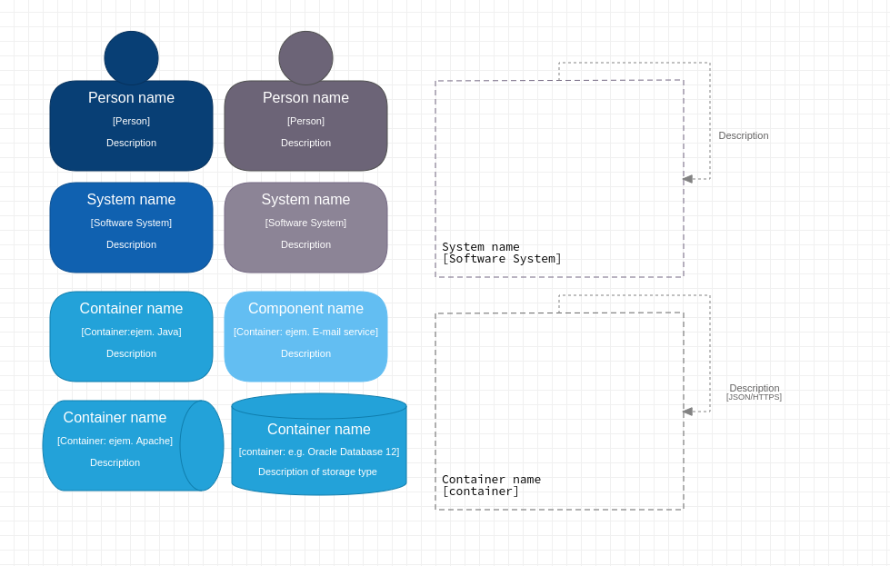

## Savne Modelo C4

  Welcome to the Savne Model C4 package documentation,
  a collaborative creation developed by the Savne SAS team. This resource is available free of charge and
  open to anyone interested.

##### General description::

  Savne Model C4 is a comprehensive tool that optimizes your design process in StarUML by
  enable you to create C4 diagrams in an effective and focused manner.
  With a focus on improving visualization,
  communication and collaboration in your software architecture projects.

#### Exploring the elements:

* Person, Person external, System, System external, Container, Component, Database,
Message Bus Container, System limit, Relationship, Relationship with technology.

   

#### Interacting with the elements:

* 

  Double-click the element to open a dialog window that will allow you to add a name,
  type, description.

  

#### Code Integration:

#### Class 'Refactor'
Functionality: This class acts as the control engine behind each element present in your diagrams.
His role is of vital importance, as he dictates and supervises several essential aspects to achieve an accurate and effective visualization.

##### Location: src/c4/Refactor.js

##### The Main Class 'Refactor' gives you the ability to: 

* Element Dimensions: Through 'Refactor', you can adjust and customize the dimensions of each element in your diagrams.
  This gives you the ability to tailor the visual representation according to the specific needs of your design.

* Color and Style: The 'Refactor' class allows you to set the color and style of elements, which contributes to a coherent visual presentation.

* Element Position: The position of each element in the diagram is managed by 'Refactor'.
  This gives you the control to arrange and align elements strategically, facilitating understanding and effective communication in your design.

